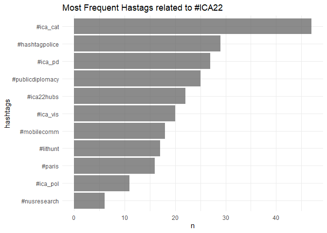

ICA22 Twitter Analysis
================
Fabio
2022-05-24

This is a short notebook outlining the code used to scrape tweets
related to the ICA22 conference in Paris.

## Packages

Load the necessary packages

``` r
# install pacman once if not avaible on your machine
# install.packages("pacman")

pacman::p_load(tidyverse, rtweet, ggraph, igraph, tidygraph)
```

## Get Data

Call Twitter API. If you want to get data yourself you have to register
with a free account where you get your personal access point to Twitter.
Check out [`rtweet`](https://github.com/mkearney/rtweet/) and follow the
instructions.

``` r
# twitter_token <- readRDS("twitter_token.rds")

rt <- search_tweets(
  "#ICA22 OR #ica22", n = 100000, include_rts = T, retryonratelimit = T, since='2022-05-01', until='2022-05-31'
)

save(rt, file = "data/rt.Rdata")
```

Lets first look at the data structure and column names. Twitter returns
over 1,200 unique tweets.

``` r
load("data/rt.Rdata")

rt %>% glimpse # the same as str, returns a df overview
```

    ## Rows: 1,874
    ## Columns: 90
    ## $ user_id                 <chr> "116016090", "116016090", "116016090", "116016~
    ## $ status_id               <chr> "1529079334216007680", "1529079007500713984", ~
    ## $ created_at              <dttm> 2022-05-24 12:38:16, 2022-05-24 12:36:58, 202~
    ## $ screen_name             <chr> "poli_com", "poli_com", "poli_com", "poli_com"~
    ## $ text                    <chr> "We are hosting an #ICA22 conversation around ~
    ## $ source                  <chr> "Twitter for iPhone", "Twitter for iPhone", "T~
    ## $ display_text_width      <dbl> 140, 140, 214, 142, 140, 143, 144, 183, 140, 1~
    ## $ reply_to_status_id      <chr> NA, NA, NA, NA, NA, NA, NA, NA, NA, NA, NA, NA~
    ## $ reply_to_user_id        <chr> NA, NA, NA, NA, NA, NA, NA, NA, NA, NA, NA, NA~
    ## $ reply_to_screen_name    <chr> NA, NA, NA, NA, NA, NA, NA, NA, NA, NA, NA, NA~
    ## $ is_quote                <lgl> FALSE, FALSE, FALSE, TRUE, FALSE, FALSE, FALSE~
    ## $ is_retweet              <lgl> TRUE, TRUE, FALSE, FALSE, TRUE, TRUE, TRUE, FA~
    ## $ favorite_count          <int> 0, 0, 106, 28, 0, 0, 0, 4, 0, 0, 4, 0, 2, 23, ~
    ## $ retweet_count           <int> 10, 11, 30, 11, 61, 4, 12, 1, 4, 5, 1, 17, 0, ~
    ## $ quote_count             <int> NA, NA, NA, NA, NA, NA, NA, NA, NA, NA, NA, NA~
    ## $ reply_count             <int> NA, NA, NA, NA, NA, NA, NA, NA, NA, NA, NA, NA~
    ## $ hashtags                <list> "ICA22", <"ica22", "newsflows">, <"ica22", "i~
    ## $ symbols                 <list> NA, NA, NA, NA, NA, NA, NA, NA, NA, NA, NA, N~
    ## $ urls_url                <list> NA, NA, NA, "twitter.com/kreissdaniel/s…", NA~
    ## $ urls_t.co               <list> NA, NA, NA, "https://t.co/fLlK4fY9Ir", NA, NA~
    ## $ urls_expanded_url       <list> NA, NA, NA, "https://twitter.com/kreissdaniel~
    ## $ media_url               <list> NA, NA, "http://pbs.twimg.com/media/FS4ciY8WQ~
    ## $ media_t.co              <list> NA, NA, "https://t.co/2OKIkjiU6Q", NA, NA, NA~
    ## $ media_expanded_url      <list> NA, NA, "https://twitter.com/poli_com/status/~
    ## $ media_type              <list> NA, NA, "photo", NA, NA, NA, NA, NA, NA, NA, ~
    ## $ ext_media_url           <list> NA, NA, "http://pbs.twimg.com/media/FS4ciY8WQ~
    ## $ ext_media_t.co          <list> NA, NA, "https://t.co/2OKIkjiU6Q", NA, NA, NA~
    ## $ ext_media_expanded_url  <list> NA, NA, "https://twitter.com/poli_com/status/~
    ## $ ext_media_type          <chr> NA, NA, NA, NA, NA, NA, NA, NA, NA, NA, NA, NA~
    ## $ mentions_user_id        <list> "350923752", <"1528736923329740802", "1519759~
    ## $ mentions_screen_name    <list> "RachelEMoran", <"newsflows_erc", "linzilinn"~
    ## $ lang                    <chr> "en", "en", "en", "en", "en", "en", "en", "en"~
    ## $ quoted_status_id        <chr> NA, NA, NA, "1527686548484931584", NA, NA, NA,~
    ## $ quoted_text             <chr> NA, NA, NA, "A pitch for our #ICA2022 preconference “What comes after disinformation studies?” We are bringing together leading scholars who have been arguing this for *years.* Agenda: https://t.co/SAVsPCzu68 https://t.co/XDQQ496P7D", NA, NA, NA, "Now that the #ica22 online platform is up, I urge my friends to spend some time soon giving feedback to early career researcher presentation.\nWith the conference being hybrid this year, we don't want those online being neglected!", NA, NA, "Help make the #ICA_POL community visible at #ICA22! \nAs things are gearing up for ICA22 in Paris, remember to use our division's hashtag and feel free to @ this account! Promote yourself and others! https://t.co/BCpYLuahf6", NA, "Excitement until the end #ica22? <U+0001FAA9>\n\nOne World, One Network<U+203D>\nThe closing plenary features 4<U+20E3> global thought leaders\n(@dfreelon @DameWendyDBE @foucaultwelles @jeffhancock) on the invention - and reinvention - of the web\n\nClosing with <U+0001F37E> @icahdq\n\n<U+0001F6A8>Sign up https://t.co/qNLCrDjE1X", "Introducing the #PolComm Who-to-follow List!\n-Just getting started in the field?\n-Looking to PolComm-ify your timeline?\nThis list will provide a rolling thread of Twitter accounts active in the discipline (random order); including their reasons for why to follow them. <U+0001F9F5><U+2935><U+FE0F> https://t.co/YgmrKYoR86", NA, NA, NA, NA, NA, NA, NA, NA, NA, NA, NA, NA
    ## $ quoted_created_at       <dttm> NA, NA, NA, 2022-05-20 16:23:50, NA, NA, NA, 2~
    ## $ quoted_source           <chr> NA, NA, NA, "Twitter for iPhone", NA, NA, NA,~
    ## $ quoted_favorite_count   <int> NA, NA, NA, 104, NA, NA, NA, 17, NA, NA, 28, N~
    ## $ quoted_retweet_count    <int> NA, NA, NA, 31, NA, NA, NA, 2, NA, NA, 9, NA, ~
    ## $ quoted_user_id          <chr> NA, NA, NA, "477336353", NA, NA, NA, "93782410~
    ## $ quoted_screen_name      <chr> NA, NA, NA, "kreissdaniel", NA, NA, NA, "katyp~
    ## $ quoted_name             <chr> NA, NA, NA, "Daniel Kreiss", NA, NA, NA, "Dr. ~
    ## $ quoted_followers_count  <int> NA, NA, NA, 10133, NA, NA, NA, 9782, NA, NA, 6~
    ## $ quoted_friends_count    <int> NA, NA, NA, 5643, NA, NA, NA, 3072, NA, NA, 59~
    ## $ quoted_statuses_count   <int> NA, NA, NA, 25298, NA, NA, NA, 120618, NA, NA,~
    ## $ quoted_location         <chr> NA, NA, NA, "", NA, NA, NA, "Seattle, Washingt~
    ## $ quoted_description      <chr> NA, NA, NA, "Prof. @UNCHussman. @unc_citap. Te~
    ## $ quoted_verified         <lgl> NA, NA, NA, FALSE, NA, NA, NA, FALSE, NA, NA, ~
    ## $ retweet_status_id       <chr> "1528777891625902080", "1529007275351875585", ~
    ## $ retweet_text            <chr> "We are hosting an #ICA22 conversation around ~
    ## $ retweet_created_at      <dttm> 2022-05-23 16:40:27, 2022-05-24 07:51:56, NA, ~
    ## $ retweet_source          <chr> "Twitter Web App", "Twitter Web App", NA, NA,~
    ## $ retweet_favorite_count  <int> 33, 23, NA, NA, 209, 21, 33, NA, 9, 41, NA, 67~
    ## $ retweet_retweet_count   <int> 10, 11, NA, NA, 61, 4, 12, NA, 4, 5, NA, 17, N~
    ## $ retweet_user_id         <chr> "350923752", "1528736923329740802", NA, NA, "4~
    ## $ retweet_screen_name     <chr> "RachelEMoran", "newsflows_erc", NA, NA, "TomD~
    ## $ retweet_name            <chr> "Rachel Moran-Prestridge, PhD", "NEWSFLOWS_ERC~
    ## $ retweet_followers_count <int> 1903, 88, NA, NA, 1994, 19063, 626, NA, 19063,~
    ## $ retweet_friends_count   <int> 1284, 188, NA, NA, 2922, 71, 926, NA, 71, 3072~
    ## $ retweet_statuses_count  <int> 156, 7, NA, NA, 966, 6209, 384, NA, 6209, 1206~
    ## $ retweet_location        <chr> "Seattle, WA ", "Amsterdam", NA, NA, "Israel",~
    ## $ retweet_description     <chr> "Postdoc at @UWCIP. I research trust in inform~
    ## $ retweet_verified        <lgl> FALSE, FALSE, NA, NA, FALSE, FALSE, FALSE, NA,~
    ## $ place_url               <chr> NA, NA, NA, NA, NA, NA, NA, NA, NA, NA, NA, NA~
    ## $ place_name              <chr> NA, NA, NA, NA, NA, NA, NA, NA, NA, NA, NA, NA~
    ## $ place_full_name         <chr> NA, NA, NA, NA, NA, NA, NA, NA, NA, NA, NA, NA~
    ## $ place_type              <chr> NA, NA, NA, NA, NA, NA, NA, NA, NA, NA, NA, NA~
    ## $ country                 <chr> NA, NA, NA, NA, NA, NA, NA, NA, NA, NA, NA, NA~
    ## $ country_code            <chr> NA, NA, NA, NA, NA, NA, NA, NA, NA, NA, NA, NA~
    ## $ geo_coords              <list> <NA, NA>, <NA, NA>, <NA, NA>, <NA, NA>, <NA, N~
    ## $ coords_coords           <list> <NA, NA>, <NA, NA>, <NA, NA>, <NA, NA>, <NA, ~
    ## $ bbox_coords             <list> <NA, NA, NA, NA, NA, NA, NA, NA>, <NA, NA, NA~
    ## $ status_url              <chr> "https://twitter.com/poli_com/status/15290793~
    ## $ name                    <chr> "APSA & ICA Political Communication Divisions"~
    ## $ location                <chr> "World", "World", "World", "World", "World", "~
    ## $ description             <chr> "Official account of the @APSAtweets & @icahdq~
    ## $ url                     <chr> "https://t.co/TaMbbU7vhB", "https://t.co/TaMbb~
    ## $ protected               <lgl> FALSE, FALSE, FALSE, FALSE, FALSE, FALSE, FALS~
    ## $ followers_count         <int> 6071, 6071, 6071, 6071, 6071, 6071, 6071, 6071~
    ## $ friends_count           <int> 591, 591, 591, 591, 591, 591, 591, 591, 591, 5~
    ## $ listed_count            <int> 154, 154, 154, 154, 154, 154, 154, 154, 154, 1~
    ## $ statuses_count          <int> 14928, 14928, 14928, 14928, 14928, 14928, 1492~
    ## $ favourites_count        <int> 3738, 3738, 3738, 3738, 3738, 3738, 3738, 3738~
    ## $ account_created_at      <dttm> 2010-02-20 20:44:37, 2010-02-20 20:44:37, 2010~
    ## $ verified                <lgl> FALSE, FALSE, FALSE, FALSE, FALSE, FALSE, FAL~
    ## $ profile_url             <chr> "https://t.co/TaMbbU7vhB", "https://t.co/TaMbb~
    ## $ profile_expanded_url    <chr> "http://www.politicalcommunication.org/", "htt~
    ## $ account_lang            <lgl> NA, NA, NA, NA, NA, NA, NA, NA, NA, NA, NA, NA~
    ## $ profile_banner_url      <chr> "https://pbs.twimg.com/profile_banners/1160160~
    ## $ profile_background_url  <chr> "http://abs.twimg.com/images/themes/theme14/bg~
    ## $ profile_image_url       <chr> "http://pbs.twimg.com/profile_images/708281203~

## The top ten retweeted tweets.

``` r
# load("rt.Rdata")
rt %>% 
  filter(!is_retweet) %>% 
  select(screen_name, text, retweet_count) %>% 
  filter(!str_detect(text, "^RT")) %>% 
  mutate(text = str_replace_all(text, "\\\n", " ")) %>% 
  arrange(desc(retweet_count)) %>% 
  top_n(n = 10) %>% 
  knitr::kable(., format = "markdown")
```

| screen\_name   | text                                                                                                                                                                                                                                                                                                                                | retweet\_count |
|:---------------|:------------------------------------------------------------------------------------------------------------------------------------------------------------------------------------------------------------------------------------------------------------------------------------------------------------------------------------|---------------:|
| josh\_braun    | People of \#ica22, a reminder that Ramon Lobato and I are again on the lookout for interesting work on media distribution for our “Distribution Matters” book series from @mitpress. If you’re doing something cool, we’d love to talk with you! <https://t.co/CrhOVopE1N> <https://t.co/Uxng1OmuCk>                                |             52 |
| poli\_com      | Interested in political communication? Going to Paris for \#ica22? Feeling overwhelmed by the conference program? We’ve got you covered! Introducing the ICA PolComm Division’s “PANELS IN PARIS” overview! \#ica\_pol <https://t.co/2OKIkjiU6Q>                                                                                    |             30 |
| lara\_schreurs | Come to our Blue Sky Workshop at \#ICA22 on the feasibility of open science for student and early career scholars. Very happy that @tdienlin, @CommFox, Patricia Moy, @claesdevreese and @TomMankowski will join us in this discussion! @icasecac <https://t.co/A46VpfamhX>                                                         |             17 |
| lara\_schreurs | @ICASECAC is organizing an awesome reception for student and early career folks at \#ICA22! Mark Sunday the 29th at 8.30 PM in your agendas. A big shout-out also to the institutions sponsoring us and making this event possible! <https://t.co/Ak5el1oFtp>                                                                       |             16 |
| drjessmaddox   | FYI, \#ica22: Paris public transport works to have a three day strike May 23-25. <https://t.co/IqEtnmlmqd>                                                                                                                                                                                                                          |             14 |
| claesdevreese  | Hallo \#ica22 friends. The fabulous @nhelberger & I have 3&lt;U+20E3&gt; \#postdoc vacancies in the exciting \#AI, \#media & \#democracy lab @UvA\_Amsterdam. Reach out and come join us and eg @TheresaJSeipp @vresendezg @tomasdoddsr @sannevrijenhoek & more. &lt;U+0001F5D3&gt;&lt;U+FE0F&gt; June 13 <https://t.co/Hnn1QaJy8M> |             13 |
| IrinaLock      | \*\*\* An alle Kommunikations-Doktoren oder soon-to-be Dr.! \*\*\* Postdoc-Stelle (100%) zu digitaler Kommunikation zu vergeben @IfkwJ &lt;U+0001F447&gt;<https://t.co/s9iyq2MkW4> @FG\_KommPol @dgpuk\_meth @DGPuK\_DigiKomm Interesse? Sprecht mich an \#ica22                                                                    |             12 |
| icahdq         | We are delighted to welcome you to attend \#ICA22, whether in Paris, at one of 11 regional hubs, or in the comfort of your own home. Check out the enthusiasm of our regional hub organizers and theme committee members! <https://t.co/WfIIsrtQM3> \#wewillmeetyouwhereyouare                                                      |             12 |
| CompCommLab    | Excited about \#ICA22? We definitely are! &lt;U+0001F389&gt; CCL will be presenting at @ica\_cm @poli\_com @ICA\_CAT @ica\_infosys, @Crem\_UL, and more. Check out our lab’s presentations and add them to your itinerary! &lt;U+0001F447&gt; <https://t.co/wHErbBNYh1>                                                             |             12 |
| MarikenVelden  | Also preparing for \#ica22 as well as &lt;U+0001F440&gt; for a job? Meet @vanatteveldt & me in Paris &lt;U+2615&gt;&lt;U+FE0F&gt;&lt;U+0001F950&gt; to talk about joining our team: <https://t.co/Etf6sSrMVX> <https://t.co/iNWfLcCiR4>                                                                                             |             12 |

## Timeline

``` r
rt %>%
  ## parse date format
  mutate(created_at = lubridate::as_datetime(created_at, "Europe/Germany")) %>% 
  mutate(
    cdate = created_at %>% 
      str_extract("\\d{4}-\\d{2}-\\d{2}") %>% 
      lubridate::ymd(),
    hour = lubridate::hour(created_at)
  ) %>% #select(created_at)
  ## select relevant time period
  filter(cdate >= as.Date("2022-05-24") & cdate <= as.Date("2022-05-31")) %>% 
  ## count tweet per and and hour
  group_by(cdate, hour) %>%
  tally %>%
  ungroup %>%
  ggplot(aes(hour, n)) +
  geom_line() +
  ## split the visualization 
  facet_wrap(~cdate, ncol = 1) +
  ggthemes::theme_hc() +
  scale_x_continuous(labels =  seq(5, 24, 3), breaks = seq(5, 24, 3)) +
  # scale_y_continuous(labels = seq(0, 60, 20), 
                     # breaks = seq(0, 60, 20), 
                     # minor_breaks = seq(0, 60, 20)) +
  ggtitle("Number of Tweets by Hour of the Day mentioning #ICA22") +
  xlab("Hour of the Day") +
  ylab("Number of Tweets")
```

<!-- -->

## Retweet Network

``` r
rt_graph <- rt %>% 
  ## select relevant variables
  dplyr::select(screen_name, retweet_screen_name) %>% 
  ## unnest list of mentions_screen_name
  unnest %>% 
  ## count the number of coocurences
  group_by(screen_name, retweet_screen_name) %>% 
  tally(sort = T) %>%
  ungroup %>% 
  ## drop missing values
  drop_na %>% 
  ## filter those coocurences that appear at least 2 times
  filter(n > 1) %>% 
  ## transforming the dataframe to a graph object
  as_tbl_graph() %>% 
  ## calculating node centrality
  mutate(centrality = centrality_degree(mode = 'in'))

rt_graph %>% 
  ## create graph layout
  ggraph(layout = "kk") + 
  ## define edge aestetics
  geom_edge_fan(aes(alpha = n, edge_width = n, color = n)) + 
  ## scale down link saturation
  scale_edge_alpha(range = c(.5, .9)) +
  ## define note size param
  scale_edge_color_gradient(low = "gray50", high = "#1874CD") +
  geom_node_point(aes(size = centrality), color = "gray30") +
  ## equal width and height
  coord_fixed() +
  ## plain theme
  theme_void() +
  ## title
  ggtitle("#ICA22 Retweet Network")
```

<!-- -->

``` r
rt_graph %>% 
  ## create graph layout
  ggraph(layout = "kk") + 
  ## define edge aestetics
  geom_edge_fan(aes(alpha = n, edge_width = n, color = n)) + 
  ## scale down link saturation
  scale_edge_alpha(range = c(.5, .9)) +
  ## define note size param
  scale_edge_color_gradient(low = "gray50", high = "#1874CD") +
  geom_node_point(aes(size = centrality), color = "gray30") +
  ## define node labels
  geom_node_text(aes(label = name), repel = T, fontface = "bold") +
  ## equal width and height
  coord_fixed() +
  ## plain theme
  theme_void() +
  ## title
  ggtitle("#ICA22 Retweet Network") +
  theme(plot.title = element_text(size = 20, hjust = 0.5))
```

<!-- -->

``` r
rt_graph %>% 
  ## create graph layout
  ggraph(layout = "circle") + 
  ## define edge aestetics
  geom_edge_fan(aes(alpha = n, edge_width = n, color = n)) + 
  ## scale down link saturation
  scale_edge_alpha(range = c(.5, .9)) +
  ## define note size param
  scale_edge_color_gradient(low = "gray50", high = "#1874CD") +
  geom_node_point(aes(size = centrality), color = "gray30") +
  ## define node labels
  geom_node_text(aes(label = name), repel = F, fontface = "bold") +
  ## equal width and height
  coord_fixed() +
  ## plain theme
  theme_void() +
  ## title
  ggtitle("#ICA22 Retweet Network")
```

<!-- -->

## Mentions Network

``` r
rt_graph <- rt %>% 
  ## remove retweets
  filter(!is_retweet) %>% 
  ## select relevant variables
  dplyr::select(screen_name, mentions_screen_name) %>% 
  ## unnest list of mentions_screen_name
  unnest %>% 
  ## count the number of coocurences
  group_by(screen_name, mentions_screen_name) %>% 
  tally(sort = T) %>%
  ungroup %>% 
  ## drop missing values
  drop_na %>% 
  ## filter those coocurences that appear at least 2 times
  filter(n > 1) %>% 
  ## transforming the dataframe to a graph object
  as_tbl_graph() %>% 
  ## calculating node centrality
  mutate(centrality = centrality_degree(mode = 'in'))

rt_graph %>% 
  ## create graph layout
  ggraph(layout = "kk") + 
  ## define edge aestetics
  geom_edge_fan(aes(alpha = n, edge_width = n, color = n)) + 
  ## scale down link saturation
  scale_edge_alpha(range = c(.5, .9)) +
  ## define note size param
  scale_edge_color_gradient(low = "gray50", high = "#1874CD") +
  geom_node_point(aes(size = centrality), color = "gray30") +
  ## equal width and height
  coord_fixed() +
  ## plain theme
  theme_void() +
  ## title
  ggtitle("#ICA22 Twitter Mentions Network")
```

<!-- -->

``` r
rt_graph %>% 
  ## create graph layout
  ggraph(layout = "kk") + 
  ## define edge aestetics
  geom_edge_fan(aes(alpha = n, edge_width = n, color = n)) + 
  ## scale down link saturation
  scale_edge_alpha(range = c(.5, .9)) +
  ## define note size param
  scale_edge_color_gradient(low = "gray50", high = "#1874CD") +
  geom_node_point(aes(size = centrality), color = "gray30") +
  ## define node labels
  geom_node_text(aes(label = name), repel = T, fontface = "bold") +
  ## equal width and height
  coord_fixed() +
  ## plain theme
  theme_void() +
  ## title
  ggtitle("#ICA22 Twitter Mentions Network")
```

<!-- -->

``` r
rt_graph %>% 
  ## create graph layout
  ggraph(layout = "circle") + 
  ## define edge aestetics
  geom_edge_fan(aes(alpha = n, edge_width = n, color = n)) + 
  ## scale down link saturation
  scale_edge_alpha(range = c(.5, .9)) +
  ## define note size param
  scale_edge_color_gradient(low = "gray50", high = "#1874CD") +
  geom_node_point(aes(size = centrality), color = "gray30") +
  ## define node labels
  geom_node_text(aes(label = name), repel = F, fontface = "bold") +
  ## equal width and height
  coord_fixed() +
  ## plain theme
  theme_void() +
  ## title
  ggtitle("#ICA22 Twitter Mentions Network")
```

<!-- -->

### Smaller Mentions Network (n &gt; 2)

``` r
rt_graph2 <- rt %>% 
  ## select relevant variables
  dplyr::select(screen_name, mentions_screen_name) %>% 
  ## unnest list of mentions_screen_name
  unnest %>% 
  ## count the number of coocurences
  group_by(screen_name, mentions_screen_name) %>% 
  tally(sort = T) %>%
  ungroup %>% 
  ## drop missing values
  drop_na %>% 
  ## filter those coocurences that appear more than 2 times
  filter(n > 2) %>% 
  ## transforming the dataframe to a graph object
  as_tbl_graph() %>% 
  ## calculating node centrality
  mutate(centrality = centrality_degree(mode = 'in'))

rt_graph2 %>% 
  ## create graph layout
  ggraph(layout = "kk") + 
  ## define edge aestetics
  geom_edge_fan(aes(alpha = n, edge_width = n, color = n)) + 
  ## scale down link saturation
  scale_edge_alpha(range = c(.5, .9)) +
  ## define note size param
  scale_edge_color_gradient(low = "gray50", high = "#1874CD") +
  geom_node_point(aes(size = centrality), color = "gray30") +
  ## equal width and height
  coord_fixed() +
  geom_node_text(aes(label = name), repel = T, fontface = "bold") +
  ## plain theme
  theme_void() +
  ## title
  ggtitle("#ICA22 Twitter Mentions Network")
```

<!-- -->

## Most Frequent Hashtags

``` r
rt_hashtags <- rt %>% 
  filter(!is_retweet) %>% 
  select(hashtags) %>% 
  ## unnest list of hastags
  unnest %>% 
    na.omit %>% 
  ## clean hashtags
  mutate(hashtags = stringr::str_to_lower(hashtags) %>% 
           str_replace_all("2018", "18") %>% 
           ## add #symbol to vector
           paste0("#", .)) %>% 
  ## count each hashtag and sort
  count(hashtags, sort = T) %>% 
  filter(n > 5)

rt_hashtags %>% 
  filter(hashtags != "#ICA22") %>%
  mutate(hashtags = forcats::fct_reorder(hashtags, n)) %>% 
  ggplot(aes(hashtags, n)) +
  geom_bar(stat = "identity", alpha = .7) +
  coord_flip() +
  theme_minimal() +
  ggtitle("Most Frequent Hastags related to #ICA22")
```

<!-- -->

## Most Frequent Bigram Network

``` r
gg_bigram <- rt %>%
  ## remove retweets
  filter(!is_retweet) %>% 
  select(text) %>% 
  ## remove text noise
  mutate(text = stringr::str_remove_all(text, "w |amp ")) %>% 
  ## remove retweets
  filter(!stringr::str_detect(text, "^RT")) %>% 
  ## remove urls
  mutate(text = stringr::str_remove_all(text, "https?[:]//[[:graph:]]+")) %>% 
  mutate(id = 1:n()) %>% 
  ## split text into words
  tidytext::unnest_tokens(word, text, token = "words") %>% 
  ## remove stop words
  anti_join(tidytext::stop_words) %>% 
  ## paste words to text by id
  group_by(id) %>% 
  summarise(text = paste(word, collapse = " ")) %>% 
  ungroup %>% 
  ## again split text into bigrams (word occurences or collocations)
  tidytext::unnest_tokens(bigram, text, token = "ngrams", n = 2) %>% 
  separate(bigram, c("word1", "word2"), sep = " ") %>% 
  ## remove the hashtag and count bigrams 
  filter(word1 != "ICA22", word2 != "ICA22") %>%
  count(word1, word2, sort = T) %>% 
  ## select first 50
  slice(1:50) %>% 
  drop_na() %>%
  ## create tidy graph object
  as_tbl_graph() %>% 
  ## calculate node centrality
  mutate(centrality = centrality_degree(mode = 'in'))
```

``` r
gg_bigram %>% 
  ggraph() +
  geom_edge_link(aes(edge_alpha = n, edge_width = n)) +
  geom_node_point(aes(size = centrality)) + 
  geom_node_text(aes(label = name),  repel = TRUE) +
  theme_void() +
  scale_edge_alpha("", range = c(0.3, .6)) +
  ggtitle("Top Bigram Network from Tweets using hashtag #ICA22")
```

<!-- -->

``` r
sessionInfo()
```

    ## R version 4.1.0 (2021-05-18)
    ## Platform: x86_64-w64-mingw32/x64 (64-bit)
    ## Running under: Windows 10 x64 (build 19044)
    ## 
    ## Matrix products: default
    ## 
    ## locale:
    ## [1] LC_COLLATE=English_Germany.1252  LC_CTYPE=English_Germany.1252   
    ## [3] LC_MONETARY=English_Germany.1252 LC_NUMERIC=C                    
    ## [5] LC_TIME=English_Germany.1252    
    ## 
    ## attached base packages:
    ## [1] stats     graphics  grDevices utils     datasets  methods   base     
    ## 
    ## other attached packages:
    ##  [1] tidygraph_1.2.0 igraph_1.2.6    ggraph_2.0.5    rtweet_0.7.0   
    ##  [5] forcats_0.5.1   stringr_1.4.0   dplyr_1.0.7     purrr_0.3.4    
    ##  [9] readr_1.4.0     tidyr_1.2.0     tibble_3.1.2    ggplot2_3.3.5  
    ## [13] tidyverse_1.3.1
    ## 
    ## loaded via a namespace (and not attached):
    ##  [1] viridis_0.6.2      httr_1.4.2         jsonlite_1.7.2     viridisLite_0.4.0 
    ##  [5] modelr_0.1.8       assertthat_0.2.1   highr_0.9          cellranger_1.1.0  
    ##  [9] yaml_2.2.1         ggrepel_0.9.1      pillar_1.6.1       backports_1.2.1   
    ## [13] lattice_0.20-44    glue_1.4.2         digest_0.6.27      polyclip_1.10-0   
    ## [17] rvest_1.0.0        colorspace_2.0-2   htmltools_0.5.1.1  Matrix_1.3-3      
    ## [21] pkgconfig_2.0.3    broom_0.7.8        haven_2.4.1        scales_1.1.1      
    ## [25] tweenr_1.0.2       ggforce_0.3.3      generics_0.1.0     farver_2.1.0      
    ## [29] ellipsis_0.3.2     pacman_0.5.1       withr_2.4.2        cli_3.0.0         
    ## [33] magrittr_2.0.1     crayon_1.4.1       readxl_1.3.1       evaluate_0.14     
    ## [37] tokenizers_0.2.1   janeaustenr_0.1.5  fs_1.5.0           fansi_0.5.0       
    ## [41] SnowballC_0.7.0    MASS_7.3-54        xml2_1.3.2         ggthemes_4.2.4    
    ## [45] tools_4.1.0        hms_1.1.0          lifecycle_1.0.0    munsell_0.5.0     
    ## [49] reprex_2.0.0       compiler_4.1.0     rlang_0.4.11       grid_4.1.0        
    ## [53] rstudioapi_0.13    labeling_0.4.2     rmarkdown_2.9      gtable_0.3.0      
    ## [57] DBI_1.1.1          graphlayouts_0.7.2 R6_2.5.0           gridExtra_2.3     
    ## [61] lubridate_1.7.10   knitr_1.33         utf8_1.2.1         tidytext_0.3.1    
    ## [65] stringi_1.6.2      Rcpp_1.0.7         vctrs_0.3.8        dbplyr_2.1.1      
    ## [69] tidyselect_1.1.1   xfun_0.24
